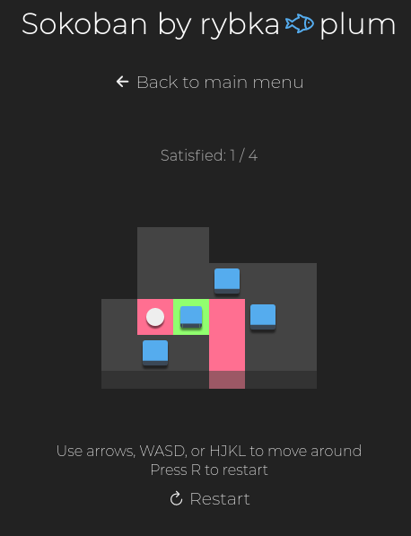
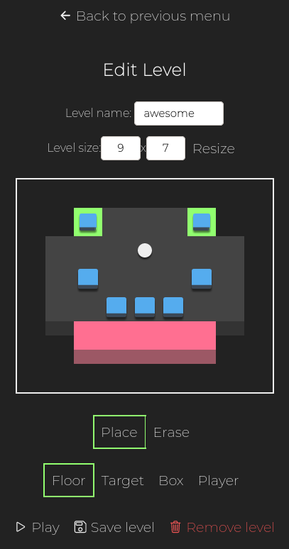

# Sokoban by rybka 🐟 plum

Sokoban game made for a Motorola Science Cup contest.

You can play the game [here](https://mhorod.github.io/sokoban/)
or clone the repository and play locally in browser.

Note: Cookies aren't persistent when using `file://` protocol.
If you want to store your game after closing browser create a server.

Tested on Chrome and Firefox.

## Features
  - 20 unique levels of various difficulty
  - play randomly selected level
  - beat game level by level
  - store your results
  - experiment and create your own levels

# Quick manual

### Random level
To play random level select "Levels by difficulty" and then choose difficulty.
There are 5 easy levels, 10 medium, and 5 hard, defined in `levels.js`

### Full game
To play through all levels go to "Full game".
There you can either continue saved game or create a new one.
After passing all levels, or pressing "Finish Game" button
the game will be deleted and score will be saved in ranking.
Progress is saved automatically after each move, and there is no undo, except restaring the game.

### Level editor
You can also create and edit your levels.

When there are no levels only "Add new level" button is visible.
Otherwise, you can choose to "Play" or "Edit" existing level.

Inside the editor you can change name, or size of the level, 
as well as place and erase level elements.
Name can be any string between 1 and 10 characters.
Size has to be between 1x1 and 30x20 tiles

# Testing and documentation

### Tests
To run tests open developer console and type `enable_tests()`.
A button will show up, pressing it will run all provided tests.

### Documentation
Documentation was generated using `jsdoc`.
You can see it [here](https://mhorod.github.io/sokoban/docs)

# Game screenshots

